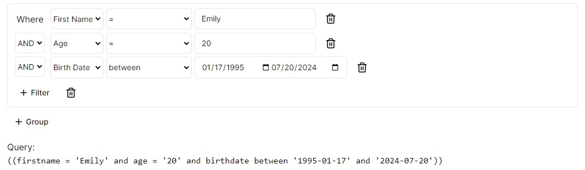

# NextJS Tailwind & Shadcn UI: SQL Query Builder



## Getting started

First, run the development server:

```bash
npm run dev
# or
yarn dev
# or
pnpm dev
# or
bun dev
```

## Query format

SQL format reference - https://react-querybuilder.js.org/docs/utils/export

## Fields

You can edit fields @/lib/fields.ts

```ts
import type { Field, RuleType } from "react-querybuilder";
import { defaultOperators, toFullOption } from "react-querybuilder";

export const validator = (r: RuleType) => !!r.value;

export const fields = (
  [
    {
      name: "firstname",
      label: "First Name",
      placeholder: "Enter first name",
      validator,
    },
    {
      name: "lastname",
      label: "Last Name",
      placeholder: "Enter last name",
      defaultOperator: "beginsWith",
      validator,
    },
    { name: "age", label: "Age", inputType: "number", validator },
    {
      name: "gender",
      label: "Gender",
      operators: defaultOperators.filter((op) => op.name === "="),
      valueEditorType: "select",
      values: [
        { name: "male", label: "Male" },
        { name: "female", label: "Female" },
      ],
    },
    { name: "height", placeholder: "cm", label: "Height", validator },
    { name: "birthdate", label: "Birth Date", inputType: "date" },
  ] satisfies Field[]
).map((o) => toFullOption(o));

```

## Tailwind Classnames styling 

You can edit fields @/lib/fields.ts. 
More classnames here https://react-querybuilder.js.org/docs/styling/classnames

```ts
export const ControlClassnames = {
  ruleGroup: "rounded-md",
  addRule:
    "rounded-md text-sm px-3 py-2 font-medium ring-offset-background transition-colors focus-visible:outline-none focus-visible:ring-2 focus-visible:ring-ring focus-visible:ring-offset-2 disabled:pointer-events-none disabled:opacity-50 hover:bg-accent hover:text-accent-foreground",
  addGroup:
    "rounded-md text-sm px-3 py-2 font-medium ring-offset-background transition-colors focus-visible:outline-none focus-visible:ring-2 focus-visible:ring-ring focus-visible:ring-offset-2 disabled:pointer-events-none disabled:opacity-50 hover:bg-accent hover:text-accent-foreground",
  operators:
    "w-[auto] rounded-md border border-input bg-background px-1 py-2 text-sm ring-offset-background placeholder:text-muted-foreground focus:outline-none focus:ring-2 focus:ring-ring focus:ring-offset-2 disabled:opacity-50 [&>span]:line-clamp-1",
  fields:
    "w-[auto] rounded-md border border-input bg-background px-1 py-2 text-sm ring-offset-background placeholder:text-muted-foreground focus:outline-none focus:ring-2 focus:ring-ring focus:ring-offset-2 disabled:opacity-50 [&>span]:line-clamp-1",
  value:
    "w-[auto] rounded-md border border-input bg-background px-3 py-2 text-sm ring-offset-background file:border-0 file:bg-transparent file:text-sm file:font-medium placeholder:text-muted-foreground focus-visible:outline-none focus-visible:ring-2 focus-visible:ring-ring focus-visible:ring-offset-2 disabled:opacity-50",
  combinators:
    "rounded-md border border-input bg-background px-1 py-2 text-sm ring-offset-background placeholder:text-muted-foreground focus:outline-none focus:ring-2 focus:ring-ring focus:ring-offset-2 disabled:opacity-50 [&>span]:line-clamp-1",
  removeRule:
    "rounded-md text-xl px-3 py-2 font-medium ring-offset-background transition-colors focus-visible:outline-none focus-visible:ring-2 focus-visible:ring-ring focus-visible:ring-offset-2 disabled:pointer-events-none disabled:opacity-50 hover:bg-accent hover:text-accent-foreground",
  removeGroup:
    "rounded-md text-xl px-3 py-2 font-medium ring-offset-background transition-colors focus-visible:outline-none focus-visible:ring-2 focus-visible:ring-ring focus-visible:ring-offset-2 disabled:pointer-events-none disabled:opacity-50 hover:bg-accent hover:text-accent-foreground",
  valueSource:
    "rounded-md border border-input bg-background px-1 py-2 text-sm ring-offset-background placeholder:text-muted-foreground focus:outline-none focus:ring-2 focus:ring-ring focus:ring-offset-2 disabled:opacity-50 [&>span]:line-clamp-1",
};

```